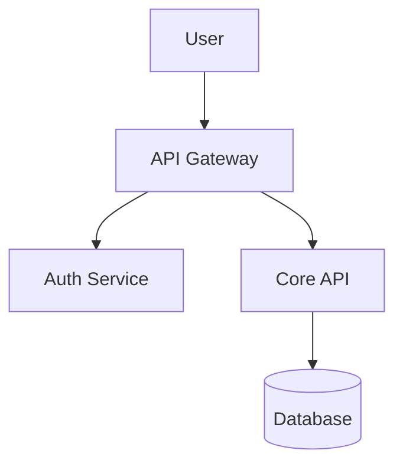
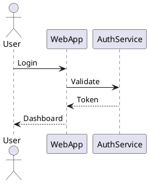

# Diagramming Tools

Diagrams communicate complex information visually. The right diagramming tool makes creating and maintaining technical illustrations efficient.

## Text-Based Diagrams

### Mermaid

Create diagrams in Markdown:

**Strengths:**
- Version controllable
- No external tools needed
- Renders in GitHub, GitLab, MkDocs

### PlantUML

UML diagrams from text:

**Strengths:**
- Comprehensive UML support
- Many output formats
- Extensive documentation

## Visual Editors

### Draw.io (diagrams.net)

Free, browser-based diagramming.

**Strengths:**
- Free and open source
- Works offline
- Many templates
- Exports to multiple formats

### Excalidraw

Hand-drawn style diagrams.

**Strengths:**
- Clean, informal look
- Collaborative editing
- Open source

### Lucidchart

Professional diagramming platform.

**Strengths:**
- Extensive shape libraries
- Team collaboration
- Integrations

## Choosing a Tool

| Need | Recommendation |
|------|---------------|
| Version control | Mermaid, PlantUML |
| Quick sketches | Excalidraw |
| Professional diagrams | Draw.io, Lucidchart |
| UML diagrams | PlantUML |
| Architecture diagrams | Draw.io, Mermaid |

## Best Practices

1. **Keep diagrams simple**: One concept per diagram
2. **Use consistent styling**: Colors, fonts, shapes
3. **Include legends**: Explain symbols
4. **Version control sources**: Track diagram changes
5. **Consider accessibility**: Alt text, color contrast

## Summary

Choose diagramming tools based on your workflow:

- Text-based for version control and automation
- Visual editors for complex diagrams
- Keep diagrams simple and focused
