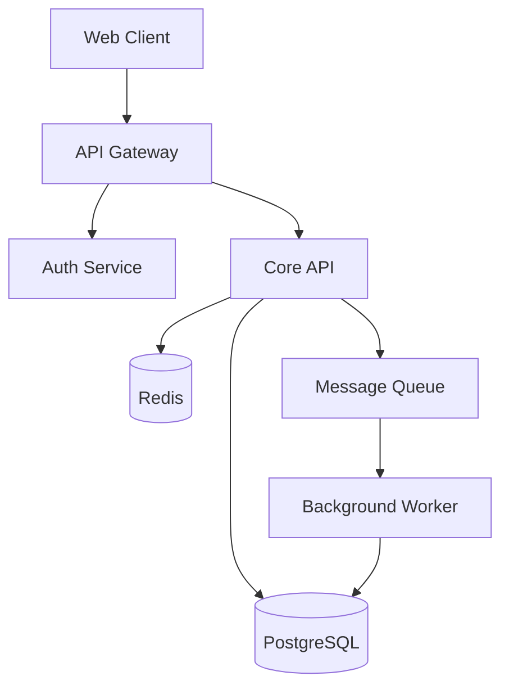

# Architecture Documents

Architecture documents describe how systems are designed and why. They capture the structure of software systems, the relationships between components, and the reasoning behind technical decisions. Good architecture documentation helps teams understand, maintain, and evolve complex systems.

## Architecture Documentation Purpose

Architecture docs serve:

- **Onboarding**: Help new team members understand the system
- **Decision making**: Provide context for future decisions
- **Communication**: Align stakeholders on system design
- **Maintenance**: Guide system changes and troubleshooting
- **Compliance**: Document systems for audits and reviews

## Types of Architecture Documents

### System Overview

High-level view of the entire system:

```markdown
# System Architecture Overview

## System Purpose

Brief description of what the system does and who uses it.

## High-Level Architecture

[Diagram showing major components]

## Key Components

| Component | Purpose | Technology |
|-----------|---------|------------|
| API Gateway | Request routing | Kong |
| Auth Service | Authentication | Node.js |
| Core API | Business logic | Python/FastAPI |
| Database | Data storage | PostgreSQL |
| Cache | Performance | Redis |
| Queue | Async processing | RabbitMQ |

## Data Flow

How data moves through the system.

## External Integrations

Third-party services the system connects to.
```

### Architecture Decision Records (ADRs)

Document individual decisions:

```markdown
# ADR 001: Use PostgreSQL for Primary Database

## Status
Accepted

## Context
We need a database for the core application. Options considered:
- PostgreSQL
- MySQL
- MongoDB
- DynamoDB

## Decision
We will use PostgreSQL.

## Rationale
- Strong JSON support for flexible data
- ACID compliance for data integrity
- Team experience with PostgreSQL
- Excellent tooling ecosystem
- Cost-effective scaling path

## Consequences
- Need to manage database infrastructure (or use managed service)
- Team must learn PostgreSQL-specific features
- Migration to another database would be significant effort

## Alternatives Considered

### MySQL
Rejected because: Limited JSON support compared to PostgreSQL.

### MongoDB
Rejected because: ACID compliance concerns for financial data.

### DynamoDB
Rejected because: Team unfamiliarity, vendor lock-in concerns.
```

### Component Documentation

Detailed documentation of specific components:

```markdown
# Authentication Service Architecture

## Overview

The Authentication Service handles user authentication,
token management, and session validation.

## Responsibilities

- Validate user credentials
- Issue and refresh JWT tokens
- Manage user sessions
- Integrate with SSO providers
- Enforce rate limiting on auth endpoints

## Architecture

```
┌─────────────────────────────────────────────────────────────┐
│                    Auth Service                              │
│  ┌──────────┐  ┌──────────┐  ┌──────────┐  ┌──────────┐    │
│  │ Login    │  │ Token    │  │ SSO      │  │ Rate     │    │
│  │ Handler  │  │ Manager  │  │ Handler  │  │ Limiter  │    │
│  └──────────┘  └──────────┘  └──────────┘  └──────────┘    │
│         │            │             │             │          │
│         └────────────┼─────────────┼─────────────┘          │
│                      ▼             ▼                        │
│              ┌──────────────────────────┐                   │
│              │    User Repository       │                   │
│              └──────────────────────────┘                   │
└─────────────────────────────────────────────────────────────┘
                           │
                           ▼
                    ┌──────────┐
                    │ Database │
                    └──────────┘
```

## Interfaces

### API Endpoints

| Endpoint | Method | Purpose |
|----------|--------|---------|
| `/auth/login` | POST | Authenticate user |
| `/auth/refresh` | POST | Refresh access token |
| `/auth/logout` | POST | End session |
| `/auth/validate` | GET | Validate token |

### Events Published

| Event | Trigger |
|-------|---------|
| `user.logged_in` | Successful login |
| `user.logged_out` | Logout |
| `auth.failed` | Failed authentication |

## Dependencies

- **User Service**: User data lookup
- **Redis**: Session storage
- **PostgreSQL**: Auth audit logs

## Security Considerations

- Passwords hashed with bcrypt (cost factor 12)
- Tokens expire after 15 minutes
- Refresh tokens valid for 7 days
- Rate limited to 10 attempts per minute
```

## Creating Architecture Diagrams

### Diagram Types

**Context diagrams**: System and its environment

```
┌─────────────────────────────────────────────────┐
│                  External World                  │
│                                                  │
│  ┌──────────┐                    ┌──────────┐   │
│  │  Users   │◄──────────────────►│  Admins  │   │
│  └──────────┘                    └──────────┘   │
│       │                               │         │
│       ▼                               ▼         │
│  ┌──────────────────────────────────────────┐   │
│  │             Our System                    │   │
│  └──────────────────────────────────────────┘   │
│       │                               │         │
│       ▼                               ▼         │
│  ┌──────────┐                    ┌──────────┐   │
│  │ Payment  │                    │  Email   │   │
│  │ Provider │                    │ Service  │   │
│  └──────────┘                    └──────────┘   │
└─────────────────────────────────────────────────┘
```

**Container diagrams**: Major components and their interactions

**Component diagrams**: Internal structure of containers

**Sequence diagrams**: Interactions over time

### Diagram Tools

- **Mermaid**: Text-based diagrams in Markdown
- **PlantUML**: Text-based UML diagrams
- **Draw.io**: Visual diagram editor
- **Excalidraw**: Hand-drawn style diagrams
- **Lucidchart**: Professional diagramming

### Mermaid Example

```markdown

```

## Writing Guidelines

### Appropriate Detail

Match detail to audience and purpose:

**Too detailed:**
> The request passes through the nginx ingress controller,
> which routes to the Kubernetes service, which load balances
> to one of three pods, each running...

**Appropriate:**
> Requests are load-balanced across multiple API instances.
> See infrastructure documentation for deployment details.

### Document Decisions, Not Just State

Explain why, not just what:

**Just state:**
> The system uses PostgreSQL.

**With rationale:**
> The system uses PostgreSQL for its strong JSON support and
> ACID compliance, which are essential for our flexible data
> model and financial transaction requirements.

### Keep Current

Architecture docs must reflect reality:

- Update when architecture changes
- Include last-updated dates
- Review periodically for accuracy
- Deprecate outdated sections

### Reference Implementation

Link to code that implements the architecture:

```markdown
## Implementation References

- Auth Service: `/services/auth/`
- API Gateway config: `/infrastructure/gateway/`
- Database schema: `/db/migrations/`
```

## Template: System Architecture Doc

```markdown
# [System Name] Architecture

**Last Updated**: [Date]
**Status**: [Draft/Review/Approved]
**Author**: [Name]

## Executive Summary

2-3 sentences describing what the system does.

## Goals and Non-Goals

### Goals
- What the system aims to achieve

### Non-Goals
- What the system explicitly does not address

## High-Level Architecture

[Context diagram]

Description of major components and their relationships.

## Detailed Design

### Component A
[Description, responsibilities, interfaces]

### Component B
[Description, responsibilities, interfaces]

## Data Model

Key entities and their relationships.

## Security

Authentication, authorization, and data protection approach.

## Scalability

How the system handles growth.

## Monitoring and Observability

Logging, metrics, and alerting approach.

## Deployment

How the system is deployed and operated.

## Future Considerations

Known limitations and potential future directions.

## Appendix

### Glossary
Key terms used in this document.

### References
Related documentation and resources.
```

## Summary

Architecture documentation captures system design and decisions:

- Document the what and the why
- Use appropriate diagram types
- Maintain documentation as systems evolve
- Match detail level to audience
- Link decisions to code implementation

Good architecture documentation helps teams understand and evolve complex systems.

---

**Next**: [Runbooks](runbooks.md) covers operational documentation.
